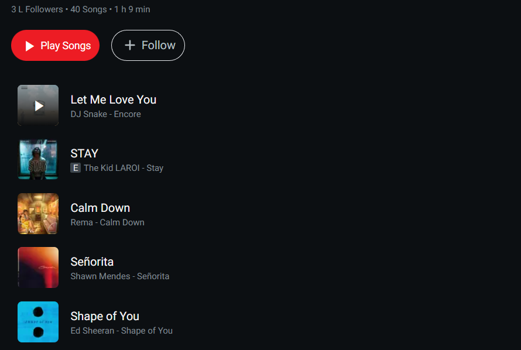
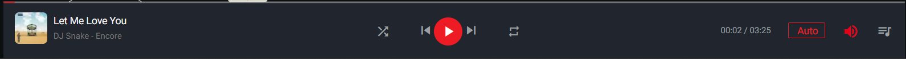

# Music Player

## Project objective

-   You have to build a music player using HTML, CSS and pure JS
-   In the end, we’ll have a result similar to the one shown below
    
    

### Project Context

-   Building a music player is not so easy task, you will counter many challenging tasks on the way you build the music player
-   Spotify is the best example of any music player that one can take reference from

**Tech Stack Prerequisites: HTML,CSS, pure JS**

### Project Steps

-   **Step 1: API key**
    -   Visit [“napster.com”](https://developer.prod.napster.com/developer) which gives us an API endpoint for fetching list of music that we can use to add to our project
    -   Create an API key by adding a new app over there, provide all required details. After generating the API key you can see examples [here](https://developer.prod.napster.com/examples) on how to use the api
-   **Step 2: Nav Bar**
    -   Create a Navigation Bar for the application.
    -   The nav bar can be created using the nav tag provided by HTML. It should have the logo of your website which makes it look professional.
    -   The nav bar should have at least 2 pages
        -   Home page, which contains list of music available and a music player below which plays music
        -   Playlist page, which contains the playlist created by the user which should be stored in the local Storage
-   **Step 3: Music Player**
    -   The main part of the application is the music player
    -   Make a music player using the audio tag provided by HTML and required CSS, the source link for songs will be provided by the Napster API we are using
    -   Write required JS code to make the music controls function properly
    -   Add an option to add music to the queue and also display the queue if user asked for it
        -   For this you don’t have to make an separate page. Just use CSS property display : none, to hide it and display : block to show it when user asks for it
    -   Add shuffle control to shuffle the music that is in the queue
    -   Also add forward and backward 5sec control, which makes it look cool
-   **Step 4: Playlist**
    -   Add an option to create playlist for this you have to implement the search option, to search through the list of music we have and adding it to the playlist
    -   The playlists created must be stored in the local Storage and whenever the playlist page is accessed, all the playlists must be fetched from the local storage itself
-   **Step 5: Search Bar**
    -   Search Bar should be there for home page, which searches music that is entered in the search bar and should display all matches
    -   We can do this by using regex expressions and for displaying we can display just above the list of all music available
    -   After user removes focus from search bar they should disappear
-   **Step 6: Filters**
    -   Add an option to filter music by artists, recently played etc.
    -   This should be done along with the search implementation in the home page

### Project checkpoints

-   Main checkpoint will be the working functionality of music player and its controls
    -   play/pause
    -   next song/ previous song
    -   shuffle music
    -   add music to queue
    -   fast forward 5 secs and reverse too
-   Playlist
    -   Playlist is one of the main checkpoints
    -   Make sure that the playlists created are stored in local storage only and there should be an option to play the playlist
-   Search Bar and Filters
    -   Search bar will be a cool functionality, so make sure it gets done too.

### How to improve?

-   If you are stuck somewhere, make sure of using the internet. You can get many things from internet
-   If you want to know what good can be done more, ask your friends to check your application. Trust me you might have missed something and that can be improved by the feedback
-   Watch different types of applications built on internet and get inspired by them
